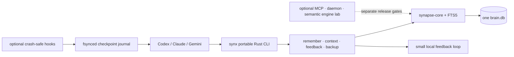

# SYNAPSE


[](https://github.com/Supersynergy/synapse-memory/actions/workflows/synapse-memory-ci.yml)
[](https://crates.io/crates/synapse-core)
[](LICENSE-CORE.md)

> **Your AI forgets. Synapse doesn't.**

Local-first Context OS for coding agents. Synapse remembers decisions, retrieves
bounded cited context, checks freshness, learns from feedback, and resumes safely
after an interrupted Codex session.

One SQLite-backed brain. No Docker. No cloud account. No LLM in the retrieval
path. Portable release = one native Rust CLI; MCP and daemon stay optional.

## Why Synapse

| Agent failure | Synapse command | Result |
|---|---|---|
| New session starts cold | `synx prime .` | Repo state, source docs, commands, and relevant memory in one startup brief |
| A decision disappears in chat history | `synx remember --kind decision "..."` | Typed durable memory with a stable id |
| Full history wastes the context window | `synx context "task" --mode coding` | Small cited pack with route, ids, and feedback hint |
| Package/API knowledge may be stale | `synx fresh-context --cwd . --prompt "..."` | Version-pinned context from local manifests and lockfiles |
| Useful retrieval should improve | `synx feedback context:<context_id> <doc_id>` | Accepted evidence rewards its retrieval route |
| Codex disconnects mid-task | Codex checkpoint hooks | Next session receives the last unfinished state, not a blind replay |

**Core promise:** best context, not biggest context.

## Install

### Portable Rust binary — canonical release path

Install a checksummed `ctxos-v*` release:

```bash
curl -fsSL https://raw.githubusercontent.com/Supersynergy/synapse-memory/main/release/synapse-memory/install.sh | sh
```

Windows PowerShell:

```powershell
irm https://raw.githubusercontent.com/Supersynergy/synapse-memory/main/release/synapse-memory/install.ps1 | iex
```

This installs only the portable native `synx` memory CLI. No Rust toolchain, Python,
Node, Docker, database server, cloud account, or API key. Platform matrix, package
contract, feature boundary, and release gates:
[release/synapse-memory/README.md](release/synapse-memory/README.md).

### From this checkout

```bash
TARGET="$(rustc -vV | sed -n 's/^host: //p')"
cargo build --locked --profile release-hardened \
  --target "$TARGET" -p synapse-cli --no-default-features
install -m 0755 "target/$TARGET/release-hardened/synx" "$HOME/.local/bin/synx"
"$HOME/.local/bin/synx" init
"$HOME/.local/bin/synx" doctor --json
```

### From a downloaded release archive

```bash
shasum -a 256 -c synapse-memory-aarch64-apple-darwin.tar.gz.sha256
tar -xzf synapse-memory-aarch64-apple-darwin.tar.gz
install -m 0755 synapse-memory-aarch64-apple-darwin/synx "$HOME/.local/bin/synx"
synx init
```

Choose the asset matching the six-target table in
[release/synapse-memory/README.md](release/synapse-memory/README.md). Windows uses
the matching ZIP and `synx.exe`.

Defaults: binary in `~/.local/bin/`; data in `~/.synapse/brain.db`. Archives never
contain memory, transcripts, session logs, embeddings, keys, or checkpoints.

## First useful session

Run this inside a project:

```bash
BRAIN="$HOME/.synapse/brain.db"

synx -f "$BRAIN" prime .
synx -f "$BRAIN" remember --kind decision \
  "Run the release verifier before publishing Synapse."
synx -f "$BRAIN" context \
  "What must pass before the next Synapse release?" --mode coding
```

The context result includes a `context_id`, selected document ids, retrieval route,
and the exact feedback command. Reward only evidence that helped the task pass:

```bash
synx -f "$BRAIN" feedback context:<context_id> <doc_id>
synx -f "$BRAIN" learn calibrate
```

For version-sensitive work, add local package/API evidence without registry access:

```bash
synx -f "$BRAIN" fresh-context \
  --cwd . --prompt "current dependencies and API constraints" --no-registry
```

## Keep Codex work across disconnects

Install the reversible checkpoint hooks:

```bash
python3 integrations/codex/install.py --dry-run
python3 integrations/codex/install.py install
```

Restart Codex once. Synapse then writes a compact checkpoint before and after tool
work and marks clean turn completion. A later `SessionStart` injects only a recent
unfinished checkpoint and tells the agent to inspect Git, files, and processes before
continuing.

Checkpoint data lives in `~/.synapse/checkpoints/`. It contains execution state,
Git HEAD, changed path names, tool name, and a command hash. It does **not** contain
the transcript, command arguments, tool-output bodies, or file contents.

Remove it without touching unrelated Codex hooks:

```bash
python3 integrations/codex/install.py uninstall
```

Full contract: [integrations/codex/README.md](integrations/codex/README.md).

## Connect an agent CLI

Build and register the local MCP server only when your agent needs MCP tools:

```bash
cargo build --release -p synapse-mcp
sh scripts/install-ctxos.sh install --all
sh scripts/install-ctxos.sh doctor --all
```

| Core MCP tool | Use it for |
|---|---|
| `context_pack(query, budget_tokens)` | Minimal verbatim state inside a hard token budget |
| `context_state(topic)` | Latest verified facts and decisions with supersession marked |
| `context_feedback(used_ids, gate)` | Reward context that helped a real gate pass |
| `context_remember(text, kind)` | Persist a durable fact or decision |

Packing is deterministic: hybrid retrieval → near-duplicate collapse → deletion
tiers → budget knapsack → serial-position ordering. No summarizing LLM call.
Implementation notes: [docs/CTXOS.md](docs/CTXOS.md) and
[docs/SPEC-ctxos-v2.md](docs/SPEC-ctxos-v2.md).

## Verify the product path

```bash
TARGET="$(rustc -vV | sed -n 's/^host: //p')"
cargo build --locked --profile release-hardened \
  --target "$TARGET" -p synapse-cli --no-default-features
SYNX_BIN="target/$TARGET/release-hardened/synx" \
  release/synapse-memory/verify.sh
```

The 15-stage verifier covers the locked dependency fetch, six-target dependency policy, RustSec and license
closure, native-binary guard, typed memory, cited context, feedback, offline
freshness, backup/restore, package/checksum/install/rollback, data-safe uninstall,
and Codex disconnect recovery.

| Engine proof | Verified result | Evidence |
|---|---:|---|
| Hybrid search, 294k docs | **35 ms p50** | [REAL_BENCH_2026-05-11.md](bench-dashboard/REAL_BENCH_2026-05-11.md) |
| HNSW-i8, SIFT-1M, ef=64 | **0.10 ms p50**, R@10 0.908 | [SIFT1M_BENCH_2026-05-12.md](bench-dashboard/SIFT1M_BENCH_2026-05-12.md) |
| Strict SQLite-WAL durability | **943k writes/s**, batch 1000 | [FAIR_DURABILITY_BENCH_2026-05-13.md](bench-dashboard/FAIR_DURABILITY_BENCH_2026-05-13.md) |

These are substrate benchmarks, not end-to-end agent-task guarantees. Benchmark
conditions and caveats live in the linked evidence.

---

## Architecture



---

<details>
<summary><strong>Engine Lab: crates, deep benchmarks, and experimental surface</strong></summary>

The Context OS flow above is the release product. This section documents the broad
engine substrate, including components that remain experimental or incomplete.

## Crate map

### Production (`crates/`)

| Crate | Role |
|-------|------|
| `synapse-core` | Store, FTS5, sqlite-vec index, KG triples, zstd/blake3 |
| `synapse-engine` | ABI bridge + RRF fusion |
| `synapsed` | Unix-socket RPC daemon |
| `synapse-cli` | CLI: put / find / hybrid / merge / sign / verify / stats |
| `synapse-mcp` | MCP server — Context-OS tools (`context_pack`/`context_state`/`context_feedback`/`context_remember`) + memory/agent tools |
| `synapse-pack` | Token-budget context packer: verbatim deletion-tiers + SimHash dedup + serial-position order (pure, no IO) |
| `synapse-space` | Agent-memory hierarchy: Space → Wing → Room → Drawer |
| `synapse-learn` | Thompson-sampling bandit router |
| `synapse-rerank` | Cross-encoder rerank (identity default; ONNX optional) |
| `synapse-extract` | Text extraction + chunking |
| `synapse-temporal` | NL date parser, bitemporal filter |
| `synapse-kernel` | NEON int8/f16/hamming kernel crate |
| `synapse-quant` | f32→i8/f16/binary, Matryoshka MRL |
| `synapse-ann` | HNSW via usearch + brute-force SIMD scan |
| `synapse-fts` | Tantivy persistent index (BMP block-max pruning) |
| `synapse-fusion` | MUVERA RRF API |
| `synapse-colbert` | MaxSim late-interaction — experimental scaffold, not production-hardened |
| `synapse-splade` | Neural-sparse inverted index (SPLADE-v3) |
| `synapse-cluster` | CRDT gossip + Raft CP-mode |
| `synapse-graph` | Knowledge-graph triples + Datalog (⚠️ semi-naive broken above 100 facts) |
| `synapse-media` | Video keyframe + audio + image embedding index |
| `synapse-multimodal` | Multimodal asset pipeline |
| `synapse-py` | PyO3 wheel (Brain, LangChain/LlamaIndex adapters) |
| `synapse-js` | JS/TS SDK via napi-rs |
| `synapse-cms` | WordPress/CMS Thompson-Beta TTL bandit |
| `synapse-market` | HFT/backtest: OHLCV + regime-vec |
| `synapse-migrate` | Import from Qdrant/LanceDB/Chroma |
| `synapse-obs` | OTel + Prometheus dashboards |
| `synapse-stream` | Pub/sub + CDC (pub/sub: 76 ns/msg; CDC: 2,241/s SQLite-bottleneck) |
| `synapse-tsdb` | Time-series: 4.26M inserts/s (fallback store; Arrow-path unbenched) |
| `synapse-mlx-olap` | GROUP BY analytics CPU: ~25M rows/s (Metal path not verified) |
| `synapse-jit` | Cranelift JIT filter: 2× vs SQLite (no speedup vs interpreter) |
| `synapsql` | MySQL-wire proxy (MariaDB bench: 700×/32×/1.85×) |
| `synapse-raft` | WAL-Raft segments, 3-node election <1s |
| `synapse-spann` | Disk-tier SPANN scaffold |

### Experimental (`experimental/`)

Stubs — excluded from default workspace build.

| Crate | Status |
|-------|--------|
| `synapse-mysql` | MySQL wire-protocol proxy (0 tests) |
| `synapse-pg` | Postgres wire-protocol proxy (0 tests) |
| `synapse-edge` | Pingora HTTP frontend (RUSTSEC blocked) |
| `synapse-rank` | LambdaMART scaffold (skeleton only) |
| `synapse-embed-gpu` | GPU embedding bridge (standalone workspace) |

---

## Benchmarks (verified, M4 Max)

Full bench files in [`bench-dashboard/`](bench-dashboard/).

### ANN — SIFT-1M 128d (1M vectors, 1000 queries)

Source: [SIFT1M_BENCH_2026-05-12.md](bench-dashboard/SIFT1M_BENCH_2026-05-12.md)

| Mode | p50 ms | QPS | R@10 | Notes |
|------|--------|-----|------|-------|
| hnsw-i8 (ef=64) | **0.10** | 10 474 | 0.908 | lowest latency, recall loss |
| hnsw-f16 (ef=64) | 0.18 | 5 723 | 0.979 | balanced |
| hnsw-f16 (ef=192) | 0.32 | 3 240 | 0.993 | recommended production |
| hnsw-f32 (ef=64) | 0.34 | 3 013 | 0.982 | highest recall potential |
| brute-force i8 | 5.43 | 182 | 0.969 | exact, no index |
| brute-force f32 | 18.53 | 54 | 1.000 | exact, no index |

**Build time caveat**: HNSW index build is 197–672s for 1M vectors (sequential usearch insert). faiss-hnsw builds in ~30–60s. Parallel batch insert is TODO.

### ANN — Small corpus (N=10k, 384d)

Source: [RAW_ANN_BENCH_2026-05-11.md](bench-dashboard/RAW_ANN_BENCH_2026-05-11.md), [LINUX_VS_MACOS_2026-05-13.md](bench-dashboard/LINUX_VS_MACOS_2026-05-13.md)

| Backend | p50 µs | R@10 |
|---------|--------|------|
| usearch-HNSW (synapse) | **77** (macOS) / **74** (Linux) | 0.942 |
| FAISS-HNSW | 98 | 0.9 |
| FAISS-Flat (exact) | 208 | 0.9 |

R@10=0.942 < 0.95 target. Needs `expansion_search` tuning for ≥0.95.

### Hybrid search — production daemon (294k docs)

Source: [REAL_BENCH_2026-05-11.md](bench-dashboard/REAL_BENCH_2026-05-11.md)

| Metric | Value |
|--------|-------|
| hybrid search p50 | **35 ms** (FTS5 + ANN + RRF + rerank, single Unix-socket call) |
| put-batch | **334 k/s** (FTS5 + vec + CRDT, persisted) |
| Qdrant gRPC vs synapse put-batch | Synapse 56× faster (local, not iso-recall) |

### MTEB retrieval (2 tasks, CPU-only)

Source: [MTEB_MINI_2026-05-11.md](bench-dashboard/MTEB_MINI_2026-05-11.md)

| Model | Task | nDCG@10 | Published | Delta |
|-------|------|---------|-----------|-------|
| bge-small-en-v1.5 | NFCorpus | 0.343 | 0.327 | +0.016 |
| bge-small-en-v1.5 | SciFact | 0.713 | 0.671 | +0.042 |

Delta vs published likely reflects MTEB 2.x scoring changes. 2 of 56 MTEB tasks measured.

### Durability — SQLite-WAL (macOS, io_uring pending Linux)

Source: [FAIR_DURABILITY_BENCH_2026-05-13.md](bench-dashboard/FAIR_DURABILITY_BENCH_2026-05-13.md)

| Durability | Batch-1 | Batch-1000 |
|------------|---------|------------|
| strict (fsync) | 7 K/s | 943 K/s |
| batched | 45 K/s | 926 K/s |
| fast (no fsync) | 110 K/s | 1.1 M/s |
| in-memory | 384 K/s | 1.3 M/s |

io_uring (Linux bare-metal) not measured; see `scripts/fair_durability_linux.sh`.

### Stream / TSDB (wave-17/18)

Source: [REAL_BENCH_WAVE17_18_2026-05-13.md](bench-dashboard/REAL_BENCH_WAVE17_18_2026-05-13.md)

| Component | Number | Notes |
|-----------|--------|-------|
| pub/sub | **13.1 M events/s** (76 ns/msg) | tokio broadcast-channel |
| TSDB insert (fallback store) | **4.26 M rows/s** | Arrow-path unbenched |
| CDC (on-disk SQLite) | 2,241 events/s | SQLite-write-per-event bottleneck |
| Datalog ancestor-closure | ❌ 7s for 100 facts | semi-naive broken, not production-ready |

---

## Feature matrix

| Feature | Status | Notes |
|---------|--------|-------|
| BM25 full-text (FTS5) | ✅ stable | 23µs/q on 10k docs |
| sqlite-vec ANN | ✅ stable | |
| Tantivy BM25 | ✅ stable | 18.3× warm-start |
| usearch HNSW | ✅ stable | 0.10ms p50 at ef=64 (SIFT-1M) |
| RRF hybrid fusion | ✅ stable | NEON SIMD 5–8× vs scalar |
| ColBERT-i8 rerank | 🧪 experimental | scaffold (`synapse-colbert`, not production-hardened); int8 quant 12.2× speed, 3.9× storage vs f32. Cross-encoder rerank is off by default — ~zero R@5 gain at ~3600× latency, see [KNOWN-ISSUES.md](KNOWN-ISSUES.md) |
| SPLADE neural-sparse (BMP) | ✅ stable | 9.7× vs naive scan |
| MUVERA full pipeline | ✅ stable | Dense+SPLADE+RRF+ColBERT, sub-ms. Rerank stage is off by default — cross-encoder rerank gave ~zero R@5 gain at ~3600× latency on the LongMemEval subset, see [KNOWN-ISSUES.md](KNOWN-ISSUES.md) |
| Conformal recall bound | ✅ stable | distribution-bound (not an absolute per-query guarantee); split-conformal, validated on a 50-question LongMemEval subset |
| CRDT gossip cluster | ✅ stable | <200ms LAN convergence |
| Raft CP-mode | ✅ minimal | `cluster-raft` feature, 3-node <1s election |
| Ed25519 signing | ✅ stable | 25µs sign + verify |
| MCP server (6 tools) | ✅ stable | Claude + Cursor native |
| Pub/sub stream | ✅ stable | 76 ns/msg |
| TSDB insert | ✅ partial | fallback store 4.26M/s; Arrow-path unbenched |
| JIT filter (Cranelift) | ✅ partial | 2× vs SQLite, no gain vs interpreter |
| Metal/MLX OLAP | ⚠️ unverified | CPU-only confirmed; Metal dispatch not observed |
| Datalog (synapse-graph) | ❌ broken | semi-naive quadratic, 7s for 100 facts |
| Python wheel (PyO3) | 🔜 planned | `synapse-py` maturin publish |
| Linux CI (aarch64) | ⚠️ partial | `synapse-extract` E0463 + `synapse-market` opensrv dep |
| CLIP cross-modal | ✅ scaffold | `multimodal` feature, ONNX swap-path |
| Audio CLAP | ✅ scaffold | `audio-clap` feature |
| VJEPA-2 video | ✅ scaffold | ONNX swap-path |

</details>

---

## Roadmap (next 3 months)

- [ ] Datalog semi-naive: delta-join + HashMap index (currently broken above 100 facts)
- [ ] HNSW parallel batch insert (target <10s for 1M vs current 197–672s)
- [ ] glass-backend CPU-SIMD beam search (expected ≥2× QPS vs usearch)
- [ ] io_uring durability bench on bare-metal Linux
- [ ] Metal dispatch verification for `synapse-mlx-olap`
- [ ] Fix `synapse-extract` Linux build (E0463 crate link-order)
- [ ] MTEB full 56-task suite (2/56 measured today)
- [ ] Python wheel publish to PyPI (`synapse-py` via maturin)
- [ ] `synapse-raft` production hardening
- [ ] Windows: native x64/ARM64 package CI, then Authenticode signing

---

## License

`synapse-core` uses FSL-1.1-ALv2 with an Apache-2.0 future grant. CLI, graph,
learning, and other utility crates inherit MIT unless their manifest says
otherwise. `synapse-engine` has separate proprietary terms and is excluded from
the portable memory release.

See [LICENSE-CORE.md](LICENSE-CORE.md), [LICENSE](LICENSE), and
[LICENSE-ENGINE.md](LICENSE-ENGINE.md).

## Contributing

See [CONTRIBUTING.md](CONTRIBUTING.md). Known issues: [KNOWN-ISSUES.md](KNOWN-ISSUES.md).
