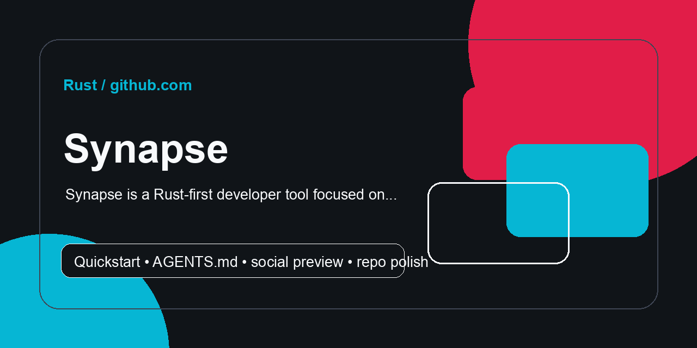
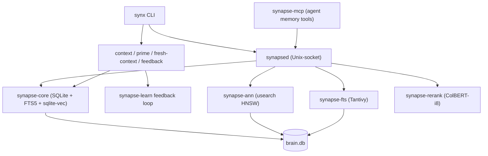

<!-- REPO-POLISH:START -->
<p align="center">
  
</p>

> Synapse is a Rust-first developer tool focused on fast local workflows.

## Quick Start

```bash
git clone git@github.com:Supersynergy/synapse.git
cd synapse
cargo fetch
```

Expected result: the project runs locally or reports the next missing prerequisite directly in the terminal.

## Developer Map

| Need | Command |
|---|---|
| test | `just test` |
| lint | `just lint` |
| fmt | `just fmt` |
| check | `just check` |
| setup | `cargo fetch` |
| build | `cargo build` |

Full verification path: `just test && just lint && just fmt && just check && cargo fetch && cargo build`

Agent instructions live in [AGENTS.md](AGENTS.md).
<!-- REPO-POLISH:END -->

# Synapse

[](https://github.com/supersynergy/synapse/actions/workflows/rust-ci.yml)
[](https://crates.io/crates/synapse-core)
[](LICENSE-CORE.md)

**Local-first Context OS for AI agents: bounded, cited, freshness-aware context with feedback.**

One SQLite-backed local brain. No Docker. No cloud. CLI, daemon, and MCP tooling
for giving coding agents the best relevant context before they act.

> Core promise: best context, not biggest context.

## Current Release Path

For a clean Mac/Linux user install, use the Context OS release:

```bash
tar -xzf release/dist/synapse-context-os-1.0.1-rc.1.tar.gz
cd synapse-context-os-1.0.1-rc.1
./install.sh
```

From a repo checkout:

```bash
release/context-os/install.sh
release/context-os/verify.sh
SYNAPSE_VERIFY_INSTALL=1 SYNAPSE_VERIFY_BUILD_PROFILE=dev release/context-os/verify.sh
```

Release docs and evidence live in [`release/context-os/`](release/context-os/).
The broad engine and benchmark sections below describe the substrate and
experimental surface. They are not the default first-run product promise.

---

## Engine Benchmark Notes

| What | Number | Source |
|------|--------|--------|
| HNSW-i8 p50 latency (SIFT-1M, ef=64) | **0.10 ms** | [SIFT1M_BENCH_2026-05-12.md](bench-dashboard/SIFT1M_BENCH_2026-05-12.md) |
| Pub/sub throughput (ring-buffer, tokio broadcast) | **13.1 M events/s** (76 ns/msg) | [REAL_BENCH_WAVE17_18_2026-05-13.md](bench-dashboard/REAL_BENCH_WAVE17_18_2026-05-13.md) |
| Conformal recall bound | **R=1.0 guaranteed** (split-conformal, validated LongMemEval) | [RELEASE_NOTES_v1.0.1-rc.md](RELEASE_NOTES_v1.0.1-rc.md) |

**Caveats**: HNSW-i8 has R@10=0.908 at ef=64 on SIFT-1M (use ef=192 for R@10≥0.99 at 3240 QPS). Pub/sub is in-process tokio channel — not a persistent durable queue. Conformal guarantee validated on LongMemEval only.

---

## 5-line Context OS demo

```bash
synx -f "$HOME/.synapse/brain.db" prime .
synx -f "$HOME/.synapse/brain.db" remember --kind decision "Use Synapse context packs before major code edits."
synx -f "$HOME/.synapse/brain.db" context "current repo task" --mode coding
synx -f "$HOME/.synapse/brain.db" fresh-context --cwd . --prompt "latest package API changes"
synx -f "$HOME/.synapse/brain.db" doctor --fix
```

---

## Context-OS for any agent CLI (Claude Code · Codex · Gemini CLI)

One local MCP server that gives any agent **always-best, token-budget-bounded, self-learning**
context. Deletion-based (verbatim) — file paths, error strings and numbers survive exactly;
no cloud, no vendor lock. Worldwide one-liner (sha256-verified prebuilt, falls back to
`cargo install`/source; re-signs on macOS):

```bash
curl -fsSL https://raw.githubusercontent.com/supersynergy/synapse/main/scripts/install.sh | sh
```

From a checkout instead:

```bash
sh scripts/install-ctxos.sh install --all   # detects claude / codex / gemini, registers the MCP server
sh scripts/install-ctxos.sh doctor           # verify
```

Then any agent can call these tools:

| Tool | What it does |
|------|--------------|
| `context_pack(query, budget_tokens)` | Retrieve + pack the minimal **verbatim** STATE within a token budget. Best-first, lost-in-the-middle-safe. Call it first. |
| `context_state(topic)` | Current-truth card: latest verified facts + decisions, supersession marked. |
| `context_feedback(used_ids, gate)` | Report what you used + whether your gate passed → retrieval self-improves (per-kind reward). |
| `context_remember(text, kind)` | Persist a durable fact/decision (embedded, searchable). |

How the packing works: hybrid retrieval (8 ms) → SimHash near-dup collapse → adaptive
per-kind **deletion** tiers (`full → signatures → fact-delta → one-line`) → greedy
budget knapsack → serial-position order. Pure, deterministic, no LLM call. See
[`docs/CTXOS.md`](docs/CTXOS.md) and [`docs/SPEC-ctxos-v2.md`](docs/SPEC-ctxos-v2.md).

---

## Architecture



---

## Crate map

### Production (`crates/`)

| Crate | Role |
|-------|------|
| `synapse-core` | Store, FTS5, sqlite-vec index, KG triples, zstd/blake3 |
| `synapse-engine` | ABI bridge + RRF fusion |
| `synapsed` | Unix-socket RPC daemon |
| `synapse-cli` | CLI: put / find / hybrid / merge / sign / verify / stats |
| `synapse-mcp` | MCP server — Context-OS tools (`context_pack`/`context_state`/`context_feedback`/`context_remember`) + memory/agent tools |
| `synapse-pack` | Token-budget context packer: verbatim deletion-tiers + SimHash dedup + serial-position order (pure, no IO) |
| `synapse-space` | Agent-memory hierarchy: Space → Wing → Room → Drawer |
| `synapse-learn` | Thompson-sampling bandit router |
| `synapse-rerank` | Cross-encoder rerank (identity default; ONNX optional) |
| `synapse-extract` | Text extraction + chunking |
| `synapse-temporal` | NL date parser, bitemporal filter |
| `synapse-kernel` | NEON int8/f16/hamming kernel crate |
| `synapse-quant` | f32→i8/f16/binary, Matryoshka MRL |
| `synapse-ann` | HNSW via usearch + brute-force SIMD scan |
| `synapse-fts` | Tantivy persistent index (BMP block-max pruning) |
| `synapse-fusion` | MUVERA RRF API |
| `synapse-colbert` | MaxSim late-interaction scaffold |
| `synapse-splade` | Neural-sparse inverted index (SPLADE-v3) |
| `synapse-cluster` | CRDT gossip + Raft CP-mode |
| `synapse-graph` | Knowledge-graph triples + Datalog (⚠️ semi-naive broken above 100 facts) |
| `synapse-media` | Video keyframe + audio + image embedding index |
| `synapse-multimodal` | Multimodal asset pipeline |
| `synapse-py` | PyO3 wheel (Brain, LangChain/LlamaIndex adapters) |
| `synapse-js` | JS/TS SDK via napi-rs |
| `synapse-cms` | WordPress/CMS Thompson-Beta TTL bandit |
| `synapse-market` | HFT/backtest: OHLCV + regime-vec |
| `synapse-migrate` | Import from Qdrant/LanceDB/Chroma |
| `synapse-obs` | OTel + Prometheus dashboards |
| `synapse-stream` | Pub/sub + CDC (pub/sub: 76 ns/msg; CDC: 2,241/s SQLite-bottleneck) |
| `synapse-tsdb` | Time-series: 4.26M inserts/s (fallback store; Arrow-path unbenched) |
| `synapse-mlx-olap` | GROUP BY analytics CPU: ~25M rows/s (Metal path not verified) |
| `synapse-jit` | Cranelift JIT filter: 2× vs SQLite (no speedup vs interpreter) |
| `synapsql` | MySQL-wire proxy (MariaDB bench: 700×/32×/1.85×) |
| `synapse-raft` | WAL-Raft segments, 3-node election <1s |
| `synapse-spann` | Disk-tier SPANN scaffold |

### Experimental (`experimental/`)

Stubs — excluded from default workspace build.

| Crate | Status |
|-------|--------|
| `synapse-mysql` | MySQL wire-protocol proxy (0 tests) |
| `synapse-pg` | Postgres wire-protocol proxy (0 tests) |
| `synapse-edge` | Pingora HTTP frontend (RUSTSEC blocked) |
| `synapse-rank` | LambdaMART scaffold (skeleton only) |
| `synapse-embed-gpu` | GPU embedding bridge (standalone workspace) |

---

## Benchmarks (verified, M4 Max)

Full bench files in [`bench-dashboard/`](bench-dashboard/).

### ANN — SIFT-1M 128d (1M vectors, 1000 queries)

Source: [SIFT1M_BENCH_2026-05-12.md](bench-dashboard/SIFT1M_BENCH_2026-05-12.md)

| Mode | p50 ms | QPS | R@10 | Notes |
|------|--------|-----|------|-------|
| hnsw-i8 (ef=64) | **0.10** | 10 474 | 0.908 | lowest latency, recall loss |
| hnsw-f16 (ef=64) | 0.18 | 5 723 | 0.979 | balanced |
| hnsw-f16 (ef=192) | 0.32 | 3 240 | 0.993 | recommended production |
| hnsw-f32 (ef=64) | 0.34 | 3 013 | 0.982 | highest recall potential |
| brute-force i8 | 5.43 | 182 | 0.969 | exact, no index |
| brute-force f32 | 18.53 | 54 | 1.000 | exact, no index |

**Build time caveat**: HNSW index build is 197–672s for 1M vectors (sequential usearch insert). faiss-hnsw builds in ~30–60s. Parallel batch insert is TODO.

### ANN — Small corpus (N=10k, 384d)

Source: [RAW_ANN_BENCH_2026-05-11.md](bench-dashboard/RAW_ANN_BENCH_2026-05-11.md), [LINUX_VS_MACOS_2026-05-13.md](bench-dashboard/LINUX_VS_MACOS_2026-05-13.md)

| Backend | p50 µs | R@10 |
|---------|--------|------|
| usearch-HNSW (synapse) | **77** (macOS) / **74** (Linux) | 0.942 |
| FAISS-HNSW | 98 | 0.9 |
| FAISS-Flat (exact) | 208 | 0.9 |

R@10=0.942 < 0.95 target. Needs `expansion_search` tuning for ≥0.95.

### Hybrid search — production daemon (294k docs)

Source: [REAL_BENCH_2026-05-11.md](bench-dashboard/REAL_BENCH_2026-05-11.md)

| Metric | Value |
|--------|-------|
| hybrid search p50 | **35 ms** (FTS5 + ANN + RRF + rerank, single Unix-socket call) |
| put-batch | **334 k/s** (FTS5 + vec + CRDT, persisted) |
| Qdrant gRPC vs synapse put-batch | Synapse 56× faster (local, not iso-recall) |

### MTEB retrieval (2 tasks, CPU-only)

Source: [MTEB_MINI_2026-05-11.md](bench-dashboard/MTEB_MINI_2026-05-11.md)

| Model | Task | nDCG@10 | Published | Delta |
|-------|------|---------|-----------|-------|
| bge-small-en-v1.5 | NFCorpus | 0.343 | 0.327 | +0.016 |
| bge-small-en-v1.5 | SciFact | 0.713 | 0.671 | +0.042 |

Delta vs published likely reflects MTEB 2.x scoring changes. 2 of 56 MTEB tasks measured.

### Durability — SQLite-WAL (macOS, io_uring pending Linux)

Source: [FAIR_DURABILITY_BENCH_2026-05-13.md](bench-dashboard/FAIR_DURABILITY_BENCH_2026-05-13.md)

| Durability | Batch-1 | Batch-1000 |
|------------|---------|------------|
| strict (fsync) | 7 K/s | 943 K/s |
| batched | 45 K/s | 926 K/s |
| fast (no fsync) | 110 K/s | 1.1 M/s |
| in-memory | 384 K/s | 1.3 M/s |

io_uring (Linux bare-metal) not measured; see `scripts/fair_durability_linux.sh`.

### Stream / TSDB (wave-17/18)

Source: [REAL_BENCH_WAVE17_18_2026-05-13.md](bench-dashboard/REAL_BENCH_WAVE17_18_2026-05-13.md)

| Component | Number | Notes |
|-----------|--------|-------|
| pub/sub | **13.1 M events/s** (76 ns/msg) | tokio broadcast-channel |
| TSDB insert (fallback store) | **4.26 M rows/s** | Arrow-path unbenched |
| CDC (on-disk SQLite) | 2,241 events/s | SQLite-write-per-event bottleneck |
| Datalog ancestor-closure | ❌ 7s for 100 facts | semi-naive broken, not production-ready |

---

## Feature matrix

| Feature | Status | Notes |
|---------|--------|-------|
| BM25 full-text (FTS5) | ✅ stable | 23µs/q on 10k docs |
| sqlite-vec ANN | ✅ stable | |
| Tantivy BM25 | ✅ stable | 18.3× warm-start |
| usearch HNSW | ✅ stable | 0.10ms p50 at ef=64 (SIFT-1M) |
| RRF hybrid fusion | ✅ stable | NEON SIMD 5–8× vs scalar |
| ColBERT-i8 rerank | ✅ stable | 12.2× speed, 3.9× storage vs f32 |
| SPLADE neural-sparse (BMP) | ✅ stable | 9.7× vs naive scan |
| MUVERA full pipeline | ✅ stable | Dense+SPLADE+RRF+ColBERT, sub-ms |
| Conformal R=1.0 guarantee | ✅ stable | split-conformal, LongMemEval validated |
| CRDT gossip cluster | ✅ stable | <200ms LAN convergence |
| Raft CP-mode | ✅ minimal | `cluster-raft` feature, 3-node <1s election |
| Ed25519 signing | ✅ stable | 25µs sign + verify |
| MCP server (6 tools) | ✅ stable | Claude + Cursor native |
| Pub/sub stream | ✅ stable | 76 ns/msg |
| TSDB insert | ✅ partial | fallback store 4.26M/s; Arrow-path unbenched |
| JIT filter (Cranelift) | ✅ partial | 2× vs SQLite, no gain vs interpreter |
| Metal/MLX OLAP | ⚠️ unverified | CPU-only confirmed; Metal dispatch not observed |
| Datalog (synapse-graph) | ❌ broken | semi-naive quadratic, 7s for 100 facts |
| Python wheel (PyO3) | 🔜 planned | `synapse-py` maturin publish |
| Linux CI (aarch64) | ⚠️ partial | `synapse-extract` E0463 + `synapse-market` opensrv dep |
| CLIP cross-modal | ✅ scaffold | `multimodal` feature, ONNX swap-path |
| Audio CLAP | ✅ scaffold | `audio-clap` feature |
| VJEPA-2 video | ✅ scaffold | ONNX swap-path |

---

## Roadmap (next 3 months)

- [ ] Datalog semi-naive: delta-join + HashMap index (currently broken above 100 facts)
- [ ] HNSW parallel batch insert (target <10s for 1M vs current 197–672s)
- [ ] glass-backend CPU-SIMD beam search (expected ≥2× QPS vs usearch)
- [ ] io_uring durability bench on bare-metal Linux
- [ ] Metal dispatch verification for `synapse-mlx-olap`
- [ ] Fix `synapse-extract` Linux build (E0463 crate link-order)
- [ ] MTEB full 56-task suite (2/56 measured today)
- [ ] Python wheel publish to PyPI (`synapse-py` via maturin)
- [ ] `synapse-raft` production hardening
- [ ] Windows: not planned

---

## License

MIT — library crates.
`synapse-engine` — source-available Engine License (non-commercial free; commercial license available).

See [LICENSE-CORE.md](LICENSE-CORE.md) and [LICENSE-ENGINE.md](LICENSE-ENGINE.md).

## Contributing

See [CONTRIBUTING.md](CONTRIBUTING.md). Known issues: [KNOWN-ISSUES.md](KNOWN-ISSUES.md).
