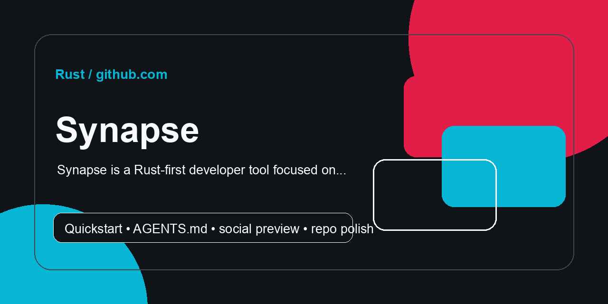

# Synapse Memory



[](#license)
[](#install)

Long-term memory for coding agents such as Claude Code, Codex and Cursor.
It keeps decisions, fixes and facts in one SQLite file on your disk and gives
your agent a short brief with sources before it starts a task.

Every new agent session starts empty. The bug you fixed last week, the reason
you picked Postgres, the deploy rule your team agreed on: the agent has to ask
again. Synapse Memory stores these as dated notes and hands back the ones that
matter for the task at hand.

Everything stays on your machine. You need no account, API key, Docker or
background service.

## Install

macOS and Linux:

```sh
curl -fsSL https://raw.githubusercontent.com/Supersynergy/synapse-memory/main/release/synapse-agent-memory/install.sh | sh
```

Windows (PowerShell):

```powershell
irm https://raw.githubusercontent.com/Supersynergy/synapse-memory/main/release/synapse-agent-memory/install.ps1 | iex
```

The installer downloads one binary, `synx`, for your system. It verifies the
SHA-256 checksum before it unpacks anything and creates your memory file at
`~/.synapse/brain.db`. An existing memory file is kept as it is.

Check that it worked:

```sh
synx --version
```

If your shell cannot find `synx`, add the install folder to your `PATH`:
`~/.local/bin` on macOS and Linux, `%LOCALAPPDATA%\Synapse\bin` on Windows.
On macOS and Linux the installer prints the exact line for you.

## First steps

Store something you want to keep (in the user brain the installer created):

```sh
synx -f ~/.synapse/brain.db remember --kind bugfix --title "Login loop" \
  "Login loop on Safari came from SameSite=Strict on the session cookie. Fixed with SameSite=Lax."
```

Ask for it later:

```sh
synx -f ~/.synapse/brain.db context "safari login loop"
```

The answer is a short Markdown brief that an agent can read directly:

```text
# Synapse Context Pack

context_id: 0cba73da100ec9d2
query: safari login loop
mode: auto
route: lexical
budget: 2400 chars

## Retrieved context

### [2] Login loop score=0.5970
source: local:synapse
Login loop on Safari came from SameSite=Strict on the session cookie. Fixed with SameSite=Lax.
```

Each entry carries its id and source, so the agent can cite it and you can
check it. The brief stays within a character budget (2,400 by default), so a
large memory never floods the prompt.

When a fact changes, store the new version as a fresh memory with a date —
`synx` keeps both, and freshness metadata prefers the newer one:

```sh
synx -f ~/.synapse/brain.db remember --kind fact \
  "Staging runs Postgres 18 since 2026-09-20."
```

## Connect your agent

Paste this into the `AGENTS.md` or `CLAUDE.md` of your project. Codex and Cursor
read `AGENTS.md`, Claude Code reads `CLAUDE.md`.

```markdown
## Memory
- Before a non-trivial task, run `synx context "<task>" --mode coding` and read the result.
- After a decision, a fix or a lesson, save it:
  `synx remember --kind decision|bugfix|fact "<what happened and why>"`.
- If a memory helped, run the `synx feedback context:<context_id> <doc_id>`
  command printed in the brief.
```

Run without `-f`, these commands use the project's own `.synapse/brain.db`.

At the start of a session, `synx prime .` briefs the agent on the repository in
front of it. The brief lists Git state, key documents, test commands and recent
memories.

For MCP-capable clients (Claude Desktop, Cursor, Windsurf) the same brain is
reachable through `synapsed` + `synapse-mcp` — see
[docs/QUICKSTART.md](docs/QUICKSTART.md) and
[crates/synapse-mcp/README.md](crates/synapse-mcp/README.md).

Codex users can add crash-safe resume. After an interrupted session, the next
one starts with a short checkpoint that names the working directory, the last
tool and the changed files. It never stores the conversation, file contents or
tool output.
Setup: [integrations/codex](integrations/codex/README.md).

## Everyday commands

| You want to | Command |
|---|---|
| Save a decision, fix or fact | `synx remember --kind decision "..."` |
| Store a raw note from stdin or `--text` | `synx put --title "..." --text "..."` |
| Get context for a task | `synx context "<task>" --mode coding` |
| Keyword / semantic / fused search | `synx find|vec|hybrid "<query>"` |
| Brief a new session on a repo | `synx prime .` |
| Rate a context brief | `synx feedback context:<id> <doc_id>` |
| Check health, repair the search index | `synx doctor --fix` |
| Back up your memory | `synx backup brain-backup.synx` |
| Restore a backup | `synx db-restore brain-backup.synx` |
| Counts and size | `synx stats` |

`--kind` accepts `decision`, `fact`, `preference`, `bugfix`, `benchmark`,
`command`, `session`, `adr`, `research` and `note`. Run `synx <command> --help`
for every option. `vec`/`hybrid` and the embedding path in `put`/`remember`
need the embedder build (`cargo build -p synapse-cli` with default features);
the portable download is keyword-only and reports missing semantic legs plainly.

## Where your memory lives

By default `synx` uses `.synapse/brain.db` relative to the current folder —
a per-project brain. The installer creates a user brain at
`~/.synapse/brain.db` (`%USERPROFILE%\.synapse\brain.db` on Windows); pass
`-f ~/.synapse/brain.db` (or set a shell alias) to read and write it from
anywhere. `synx` creates the file and its folder on first use.

The file is plain SQLite. You can copy it, back it up with any tool and open it
with `sqlite3`. Synapse Memory stores only what you or your agent save with
`remember`. It never records transcripts.

To uninstall on macOS or Linux, delete `~/.local/bin/synx` and, after an
upgrade, `~/.local/bin/synx.previous`. Your memory file stays until you delete
it yourself.

## What the download includes

The installer ships the portable release, version `2.1.0`. It includes
the `synx` command line with keyword search, cited context briefs, typed and
dated memories, feedback, health checks, backup, restore, merge and Ed25519
signatures. It runs on macOS, Linux and Windows, on x86-64 and on macOS/Linux ARM64 (Windows ARM64 is not built yet — the vendored usearch/numkong stack cannot compile under MSVC arm64).

Search in the download is keyword-based. Vector search, the `synapsed` daemon
and the `synapse-mcp` MCP server are part of this repository and need a build
from source. MCP setup for Claude Desktop, Cursor and Windsurf:
[docs/QUICKSTART.md](docs/QUICKSTART.md) and
[crates/synapse-mcp/README.md](crates/synapse-mcp/README.md).

Exact capability list: [FEATURES.md](release/synapse-agent-memory/FEATURES.md).
How each release is verified: [PROOF.md](release/synapse-agent-memory/PROOF.md).

## Build from source

You need a Rust toolchain ([rustup](https://rustup.rs)).

```sh
git clone https://github.com/Supersynergy/synapse-memory.git
cd synapse-memory
cargo build --release --locked -p synapse-cli
./target/release/synx --version
```

The first build takes a few minutes. A source build of `main` reports its
workspace version (`2.1.0`), which differs from the release numbering.

Layer map: [ARCHITECTURE.md](ARCHITECTURE.md). Workflow and checks:
[CONTRIBUTING.md](CONTRIBUTING.md).

## License

- `crates/synapse-core` uses [FSL-1.1-ALv2](LICENSES/FSL-1.1-ALv2.txt). You may
  use, change and share it for any purpose except a competing commercial
  product. Two years after each release, that release becomes Apache-2.0.
  Shipped binaries compile the MIT-licensed vendored copy under
  `vendor/synapse-db`, not this crate.
- The command line and most other crates use [MIT](LICENSES/MIT.txt).
  `synapse-kernel` and `synapse-embed-gpu` use MIT or Apache-2.0.
- `crates/synapse-engine` is source-available and is not part of the download.
  See [LICENSE-ENGINE.md](LICENSE-ENGINE.md).

Every release archive contains both license texts and a list of all
third-party dependencies with their licenses.

## Help and contributing

- Bugs and questions: [GitHub Issues](https://github.com/Supersynergy/synapse-memory/issues)
- Known gaps: [KNOWN-ISSUES.md](KNOWN-ISSUES.md)
- Security reports: [SECURITY.md](SECURITY.md)
- Contributing: [CONTRIBUTING.md](CONTRIBUTING.md)
- Changes per version: [CHANGELOG.md](CHANGELOG.md)
