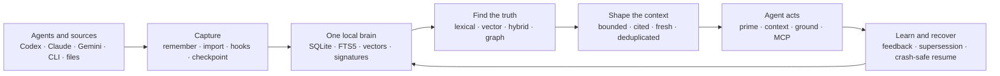

# Synapse release blueprint — 2026-07-13

## Antwort in 60 Sekunden

Release Synapse as **the local Context OS that lets every agent remember, recover, and continue**.

Do not lead with vector-database internals or the full crate inventory. Lead with
the broken human experience: every new AI session starts with amnesia, loads too
much context, and can lose its last step after an interruption. Synapse fixes all
three with one local brain.

> **Your AI forgets. Synapse doesn't.**
> One local brain. Bounded context. Cited memory. Crash-safe resume.

Current proof, measured on 2026-07-13:

| Signal | Result | Evidence |
|---|---:|---|
| Live local brain | 318,590 docs / 317,365 vectors | `synx stats`; socket active |
| Recall command | 139.1 ms mean, 13.8 ms stddev | `hyperfine`, 12 runs, warmup 3 |
| Context-OS release smoke | 13/13 PASS | `SYNX_BIN=~/.local/bin/synx release/context-os/verify.sh` |
| Codex crash-safe hook tests | 6/6 PASS | `python3 -m unittest integrations/codex/hooks/test_checkpoint.py -v` |
| Remote CI | blocked by formatting only; tests/clippy/audit/deny green | GitHub run 29234718730 |

These are release-snapshot numbers, not universal latency promises.

## The product users should see



### Six feature lanes, one sentence each

| Lane | User-visible capability | Commands / surfaces |
|---|---|---|
| Remember | Store typed facts, decisions, bugs, benchmarks, and sources locally. | `remember`, `put`, importers, hooks |
| Retrieve | Search exact words, meaning, both together, or connected graph context. | `find`, `vec`, `hybrid`, `ground`, `graph` |
| Context | Give an agent the smallest useful, cited, freshness-aware pack. | `context`, `prime`, `fresh-context`, MCP |
| Learn | Reward useful memories, demote noise, preserve supersession. | `feedback`, `learn`, Context-OS feedback loop |
| Trust | Keep data local, signed, portable, repairable, and syncable. | Ed25519, `doctor`, `backup`, `restore`, CRDT |
| Recover | Resume after a dropped connection without replaying a mutation blindly. | Codex checkpoint hooks, append-only journal, atomic latest snapshot |

The full retrieval engine, ANN work, market engine, WordPress layer, multimodal
scaffolds, and experimental crates remain valuable. They belong below the fold
under **Engine Lab**, with stable/partial/experimental labels. They must not make
the first-run product look like five products at once.

## The hero image

### Visual idea

A dark editorial scene. Several bright but fragmented agent trails enter from
the left. One trail is visibly broken by a network gap. In the center, a warm
local memory core holds a small glowing checkpoint capsule. From the right,
one clean, cited beam exits toward a calm terminal. The image communicates:
capture, local storage, retrieval, context compression, feedback, and recovery.

### Hero overlay

```text
SYNAPSE
Your AI forgets. Synapse doesn't.
Local memory · bounded context · crash-safe resume
```

Keep text outside the generated artwork and overlay it in README/social tooling.
This avoids garbled image text and makes the same artwork reusable for GitHub,
Skool, Hacker News, X, and a launch video.

## Show every important feature without a wall of text

### README order

1. Hero: pain, promise, four proof chips.
2. 30-second demo: `remember → context → disconnect → resume`.
3. Six-lane feature map above.
4. Honest benchmark cards linked to raw evidence.
5. Install and uninstall paths.
6. Privacy and trust model.
7. Engine Lab, compatibility, known gaps.
8. Contributing, roadmap, license.

### 30-second terminal demo

```bash
synx prime .
synx remember --kind decision "Ship Context OS before Engine Lab."
synx context "what should this agent do next?" --mode coding
python3 integrations/codex/install.py install
synx doctor --json
```

Then deliberately interrupt Codex after a file mutation. Restart in the same
repo. The first visible block should be `synapse_recovery`, followed by a Git
state check and continuation from the verified delta. That is the memorable
demo. It proves more than another retrieval benchmark.

## Disconnect protection contract

### What already exists

Codex appends the active task to a local JSONL rollout while work is happening.
Repository edits and completed shell side effects already live outside the chat.
The missing piece was a compact, deterministic resume pointer.

### What the new Synapse integration adds

1. `PreToolUse`: append and `fsync` intent before a potentially mutating tool.
2. `PostToolUse`: append and `fsync` completion, Git HEAD, changed path names,
   and success state. No output body, command arguments, or file content.
3. `Stop`: mark the turn complete.
4. `SessionStart`: inject only a recent unfinished checkpoint.
5. Resume rule: inspect Git/files/processes first; never replay a mutation blindly.

### Machine-checkable oracle

The feature passes only when this scenario passes:

```text
start task → mutate fixture → cut connection before Stop → start new session
→ recovery block appears → existing mutation is detected → no duplicate mutation
→ targeted test passes
```

This must become a release-gate fixture before the public tag.

## Release path

### Release identity

Use one public product name: **Synapse Context OS**.

- Repository: `Supersynergy/synapse`
- Binary: `synx`
- First clean product tag: `ctxos-v1.0.0`
- Engine experiments: same repository, clearly labelled **Engine Lab**

Do not mix root tags (`v2.x`) and Context-OS tags in product copy. The release
workflow already uses `ctxos-v*`; make that the canonical product namespace.

### Gates before changing the private repository to public

| Gate | Current state | Release action |
|---|---|---|
| Product scope | mixed Context OS + broad engine in README | put Context OS first; Engine Lab below fold |
| Worktree | many existing modified/untracked files | classify, commit, or isolate; never publish accidental state |
| CI | tests/clippy/audit/deny pass; `fmt` fails | format in a clean release branch, rerun all workflows |
| Versioning | multiple historical root tags | canonicalize `ctxos-v*` and document migration |
| Privacy | repository currently private | run secret, PII, bundled-brain, key, and license gates before public switch |
| Install | local smoke passes 13/13 | verify clean macOS arm64/x64 and Linux x64/arm64 artifacts |
| Recovery | implementation + 6 unit tests pass | add forced-disconnect end-to-end fixture |
| Social proof | no current public release page | add hero, 12-second demo, raw benchmark links, release notes |

Public visibility is a separate, irreversible product decision. Do it only after
all gates are green and the owner explicitly approves the switch.

## Launch assets

### 12-second video/GIF

```text
0–2s   Agent starts with amnesia. Huge context wall.
2–4s   synx prime . → one bounded startup brief.
4–6s   318,590 docs → 8 cited results in 139 ms local snapshot.
6–8s   Network line breaks after an edit.
8–10s  Codex reopens → synapse_recovery appears.
10–12s Test passes. End card: Your AI forgets. Synapse doesn't.
```

### Launch headline options

1. **Your AI forgets. Synapse doesn't.**
2. **One local brain for every coding agent.**
3. **Stop rebuilding context every session.**
4. **The memory layer that survives the chat.**

### Launch challenge

> Run the Synapse Disconnect Test: make one controlled edit, cut the session,
> reopen the repo, and show whether your agent continues without duplicating work.

This creates shareable proof. Raw-vs-routed token charts remain supporting proof;
the emotional hook is continuity.

## Friction audit

| Class | Friction | Fix |
|---|---|---|
| Critical | README asks the user to understand the engine before the outcome | Context-OS hero + 30-second demo first |
| Critical | Red CI destroys release trust | clean branch + format gate + green badge before launch |
| Critical | Disconnect can lose the agent's resume pointer | shipped checkpoint hook + forced-disconnect E2E |
| Critical | Private raw install URL cannot work for outside users | public switch only after security/license gate |
| Useful | Too many feature names compete for attention | six user lanes; full crate map below fold |
| Useful | Benchmarks lack one visual narrative | four proof chips + raw evidence links |
| Do not build | New hosted dashboard before adoption | terminal demo and GitHub proof first |
| Do not build | Cloud account system | local-first/no-account is the product advantage |

## One next step

Create a clean release branch from `main`, carry only the Context-OS release,
Codex recovery integration, README narrative, and launch assets into it, then run
the complete release gate. Do not merge the unrelated dirty corpus/market work
into the public-release diff by accident.
