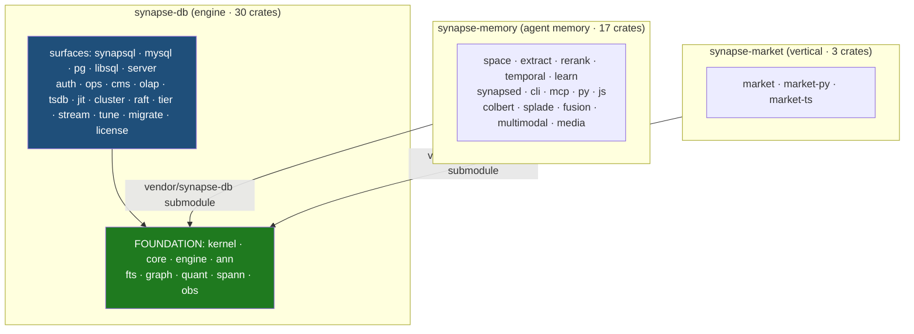
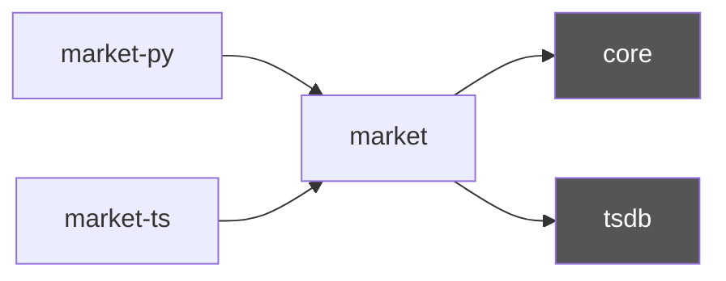

# Synapse Split — Dependency Maps + Security Analysis

Generated 2026-05-31 from `cargo metadata` (real internal edges) + `grepgod --chain security`.

## 0. Three-repo boundary


Arrows are strictly `memory→db` and `market→db`. **No `db→memory` edge** (proven by standalone `cargo check`).

## 1. synapse-db internal graph (foundation green, surfaces blue)

```mermaid
graph LR
  core --> ann & engine & fts & graph & kernel & obs & quant & spann
  spann --> kernel
  synapsql --> core & libsql & mysql & pg
  server --> auth & graph & libsql & mysql & ops & pg & tune
  mysql --> libsql
  pg --> libsql
  cms --> core
  cluster --> core
  migrate --> core
  ops --> core
  tune --> core
  classDef f fill:#1f7a1f,color:#fff
  class core,ann,engine,fts,graph,kernel,obs,quant,spann f
```
`core` is the hub (14.6k LOC, 322 pub fns). Everything funnels through it.

## 2. synapse-memory internal graph (foundation = external, via submodule)

```mermaid
graph LR
  subgraph vendor["vendor/synapse-db (submodule)"]
    core; graph; kernel; engine; ann; rerank_dep[license]
  end
  cli --> core & graph & learn
  space --> ann & core & engine & rerank
  extract --> core & graph
  synapsed --> core & rerank_dep & rerank
  learn --> core
  rerank --> core
  media --> core
  js --> core
  colbert --> kernel
  fusion --> colbert & splade
  classDef v fill:#555,color:#fff
  class core,graph,kernel,engine,ann,rerank_dep v
```
Memory's recall stack (`space → rerank`, `fusion → colbert + splade`) sits on top; foundation crates resolve from the pinned submodule.

## 3. synapse-market


`core` + `tsdb` come from the submodule. (`mcp→market` edge was cut from synapse-memory.)

## 4. grepgod `--chain security` (synapse-db, 2026-05-31)

- **gitleaks**: 0 secrets (192 commits of preserved history scanned). ✅
- **semgrep** (OWASP + lang-auto): no findings.
- **osv-scanner**: 8 transitive-dep advisories — **0 Critical, 0 High, 1 Medium, 2 Low, 5 Unknown**.

| Advisory | Sev | Package | Fix |
|---|---|---|---|
| RUSTSEC-2026-0002 | 2.7 Med | `lru` 0.12.5 / 0.13.0 | → 0.16.3 (**fixable**) |
| GHSA-2f9f-gq7v-9h6m | 5.3 | `thrift` 0.17.0 | none (via arrow/parquet) |
| RUSTSEC-2025-0057 | — | `fxhash` 0.2.1 | none |
| RUSTSEC-2024-0384 | — | `instant` 0.1.13 | none (unmaintained) |
| RUSTSEC-2025-0119 | — | `number_prefix` 0.4.0 | none |
| RUSTSEC-2024-0436 | — | `paste` 1.0.15 | none (unmaintained) |
| RUSTSEC-2025-0134 | — | `rustls-pemfile` 2.2.0 | none |

2 fixable (the `lru` bump). The rest are transitive/unmaintained-crate advisories with no patched version — track via the `security.yml` workflow (cargo-deny + cargo-audit) and allowlist in `deny.toml`. None are Critical/High.

**All three repos (grepgod security 2026-05-31):** secrets = **0** everywhere (gitleaks).

| Repo | Advisories | Crit | High | Med | fixable |
|---|---|---|---|---|---|
| synapse-db | 8 | 0 | 0 | 1 | 2 |
| synapse-memory | 7 | 0 | 0 | 1 | 1 |
| synapse-market | 5 | 0 | 0 | 1 | 1 |

No Critical/High in any repo. All Medium = the `lru` RUSTSEC-2026-0002 (fixable via bump).

## How to regenerate
```bash
# edges:  cargo metadata --no-deps | jq '.packages[] | ... synapse-* deps'
# security: cd <repo> && grepgod --chain security    # gitleaks + semgrep + osv-scanner
```
