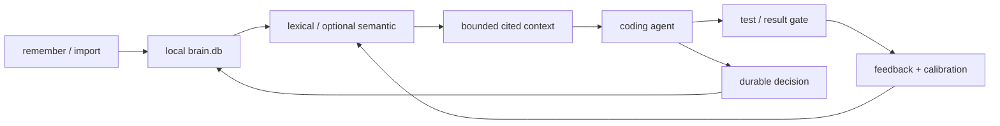

# Synapse capability map

This map separates the portable memory product from the broader monorepo. A crate
existing in the workspace does not make it a shipped feature.

## Portable product: ship in every asset

| Capability | User command or surface | Release status |
|---|---|---|
| Single-file local memory | `synx init`, `put`, `remember`, `find` | Ship |
| Exact lexical retrieval | `find`, context lexical route | Ship |
| Bounded cited context | `context --mode coding [--json]` | Ship |
| Repo startup grounding | `prime <repo>` | Ship |
| Package/API freshness | `fresh-context --no-registry` | Ship |
| Retrieval feedback | `feedback`, `learn calibrate/status` | Ship |
| Health and repair | `doctor`, `db-verify`, `db-repair` | Ship |
| Portable exchange | Unencrypted `backup`, `db-restore`, `snap`, `restore`, `merge` | Ship |
| Integrity and trust | BLAKE3, Ed25519 `keygen/sign/verify`, source metadata | Ship |
| Typed import/export | CSV, TSV, JSON(L), SQLite, brainpack | Ship |
| Knowledge graph basics | relate, neighbors, traversal, PageRank, paths | Ship with limits documented |
| CRDT federation | TCP cross-platform; Unix sockets on Unix | Release candidate until Windows CI passes |
| Raw corpus promotion | Text, RSS, web, transcript ingest/search/eval/promotion | Ship; PDF is optional |

Portable builds store memories without embeddings and say so once on write. They
do not report missing vectors or an absent embedding cache as health failures.

## Optional adapters: package separately

| Capability | Why separate |
|---|---|
| Codex crash-safe resume | Small Python hook adapter around a Rust memory core; Codex-specific lifecycle |
| MCP server | Current implementation connects to a Unix socket; not a Windows-portable core dependency |
| Warm daemon | Current `synapsed` transport is Unix-only and pulls heavier embedding/rerank features |
| Semantic embedding build | ONNX/model distribution, first-run download, binary size, and per-platform linking require their own gate |
| Encrypted backup | `age` and its unmaintained macro dependency stay outside the zero-warning portable closure |
| PDF ingest | `lopdf`/font parsing stays outside the minimal memory artifact; text/web ingest remains available |
| IVF sharding/turbo/Tantivy | Rayon, proprietary engine, ANN and benchmark substrate are not required for personal agent memory |
| Agent CLI registration | Vendor-specific config mutation must remain reversible and opt-in |

## Engine Lab: do not place in the memory download

- ANN/usearch experiments, ColBERT, SPLADE, SPANN, MUVERA, conformal research
- MySQL/Postgres wire proxies and SynapsQL
- market/HFT, TSDB, streaming, OLAP, JIT, io_uring, Raft/cluster experiments
- multimodal, media, CLIP/audio/video scaffolds
- CMS, server, auth, license server, dashboards, observability stacks
- benchmark runners, fuzz corpora, graph outputs, local databases, keys, caches

These may reuse the engine but they increase compile surface, platform risk, audit
cost, and product confusion. They earn separate packages only after independent
users and release gates exist.

## Memory loop

## Product promise that can be defended now

Synapse is a stronger fit when the job is local coding-agent continuity with exact
paths, errors, decisions, compact cited context, offline operation, and crash-safe
resume. It is not yet proven superior for automatic conversational memory extraction,
temporal knowledge-graph quality, multi-user SaaS, or connector breadth.
